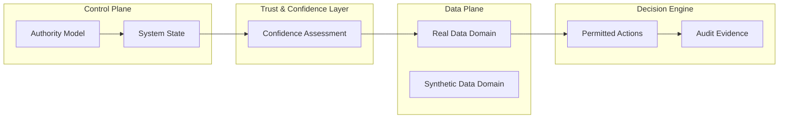

  
  
  
  
  

# EdgeResilienceLab

This repository is a professional architectural reference and governance framework.  
It is conceptual in nature and does not constitute an implementation, product, or deployment guidance.

## Purpose
Edge Resilience Lab is an architectural exploration repository for governed systems design, resilient operations, and applied control patterns under constraints.

## Boundary
This repository is architectural in nature. It is not presented as a finished operational product. It emphasizes human-in-the-loop review, explicit controls, and auditability.

## How to use
Review the README, diagrams, and governance artifacts first. Then inspect the documented patterns and apply them as controlled references for future implementation work.

---

## Executive Positioning

EdgeResilienceLab describes a deterministic control system with constrained AI advisory components, designed to remain operable, auditable, and governable under uncertainty, degradation, and failure.

The system assumes failures will occur and treats correct failure handling as a first-class design objective.

Authority is explicit, bounded, and never inferred from probabilistic outputs.

Artificial intelligence and synthetic data are used exclusively as non-authoritative support mechanisms, reinforcing observability, continuity, and resilience when real-world signals are degraded or unavailable.

This repository is not a product implementation.  
It is a professional architectural reference for onboarding, audit discussion, bid preparation, and systems-design reasoning.

---

## Principle of Operation

The system never stops.  
It adapts, degrades, recovers, and evolves.

Failures are assumed.  
Correct failure handling is a design objective, not an exception.

When confidence drops, the system changes how it thinks, how it acts, and how authority is exercised.

---

## Why This Exists

In real-world environments:

- Sensors fail silently  
- Data degrades before disappearing  
- Machine-learning overconfidence becomes a liability  
- Cloud connectivity is optional, not guaranteed  

Most systems optimize for performance.  
This system optimizes for survival with integrity.

---

## Governing Principle (Non-Negotiable)

Availability and trustworthiness are more important than absolute precision.

This principle governs all architectural decisions.

---
## High-Level Architecture

---
Nothing is peer-to-peer.  
Everything obeys explicit system state and governance rules.

---
## What This Repository Demonstrates

- Control Plane–driven governance  
- Explicit degradation modes  
- Bounded use of synthetic data with ethical constraints  
- Explainable and auditable decisions  
- Self-documenting operational behavior  
- Audit-ready design from day one  
---
## Who This Is For

- Staff and Principal Engineers  
- System Architects  
- CTOs and Technical Leaders  
- Risk, Compliance, and Operations teams  
---
## What This Is Not

- A demo-only machine learning project  
- A cloud-dependent architecture  
- A black-box AI system  

---

---

## Integrated Public Scope

EdgeResilienceLab is published as a **Work in Progress** architecture and portfolio repository.  
The repository combines the original ERL architectural reference with complementary public assets that strengthen its professional value without exposing implementation-sensitive internals.

The public scope includes:

- resilience-first conceptual architecture;
- C4 and SysML visual reasoning artifacts;
- RFP-style evaluation framing based on a conceptual as-built model;
- capability roadmap and conceptual maturity progression;
- governed AI decision-boundary and authority-flow materials;
- CI/CD publication and deployment automation assets;
- multiplatform device discovery and assessment tooling;
- legal, IP, and publication-boundary material.

This integration is intentionally **public-facing**. Internal recovery logic, incomplete platform implementation details, and unvalidated hardware-specific procedures remain outside this repository until they are suitable for publication.

---

## Repository Map

| Area | Path | Role in ERL |
|---|---|---|
| Canonical overview | [`README.md`](README.md), [`README.non-technical.md`](README.non-technical.md) | Executive and non-technical positioning |
| Operating guide | [`HOW_TO_USE.md`](HOW_TO_USE.md) | Guided reading paths and usage boundaries |
| RFP simulation | [`RFP.md`](RFP.md) | Procurement-style evaluation over the conceptual as-built architecture |
| Capability maturity | [`ROADMAP.md`](ROADMAP.md), [`CHANGELOG.md`](CHANGELOG.md) | Roadmap and conceptual maturity progression |
| Architecture diagrams | [`diagrams/C4/`](diagrams/C4/), [`diagrams/SysML/`](diagrams/SysML/) | Visual architecture and authority/state reasoning |
| ERL automation | [`automation/`](automation/) | Publication, governance, and repository automation scripts |
| CI/CD assets | [`automation/GH_CI-CD/`](automation/GH_CI-CD/) | Complete CI/CD automation block with manuals and workflows |
| Governed AI layer | [`governance/governed-ai-architecture/`](governance/governed-ai-architecture/) | Decision-boundary, authority, risk, and governed AI reference case |
| Device discovery tooling | [`tooling/inventory-stream7-rescue/`](tooling/inventory-stream7-rescue/) | Multiplatform inventory, assessment, and evidence-first reporting |
| Examples | [`examples/`](examples/) | Minimal and degraded-mode conceptual demonstrations |
| Publication boundary | [`LEGAL_AND_IP.md`](LEGAL_AND_IP.md), [`DISCLAIMER.md`](DISCLAIMER.md) | Public scope, limitations, IP, and non-production positioning |

---

## Portfolio Interpretation

This repository is intended to demonstrate senior architectural judgment, not to present a finished product.  
It shows how a resilient edge system can be framed through governance, degraded-mode reasoning, auditability, publication automation, and hardware-discovery evidence.

The repository is suitable for:

- architecture review discussions;
- portfolio evaluation for Staff / Principal architecture roles;
- RFP and bid-preparation simulations;
- technical governance conversations;
- controlled publication of NDA-safe architecture material.

---

## Evolution

This project evolves through capability maturity, not dates.  
See [ROADMAP.md](ROADMAP.md) and [CHANGELOG.md](CHANGELOG.md).
