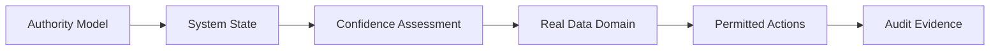

# EdgeResilienceLab — Non-Technical Overview

## What is this?

EdgeResilienceLab is a reference guide that explains **how critical technological systems should behave when reality goes wrong**.

It is not software.
It is not a product.
It is not a company offering.

It is a **thinking framework** for designing systems that remain trustworthy when:

- Sensors fail
- Data becomes unreliable
- Networks disconnect
- Humans make mistakes
- Environments become unpredictable

---

## Why does this matter?

In many industries — transportation, energy, industrial automation, infrastructure —  
systems are expected to operate continuously and safely.

But in real life:

- Devices break
- Data lies
- Software crashes
- People misconfigure things

Most systems assume ideal conditions.

**EdgeResilienceLab assumes failure is normal.**

---

## The core idea

A resilient system must always know:

- What state it is in
- How trustworthy its data is
- What it is allowed to do
- When to ask for human help

And it must record every important decision for later review.

---
## Resilient Decision Flow

---

## What this repository contains

This repository contains:

- Simple explanations of system operational states  
  → [docs/architecture/overview.md](docs/architecture/overview.md)

- Governance and authority rules  
  → [docs/architecture/control-plane.md](docs/architecture/control-plane.md)  
  → [docs/adrs/ADR-001-Control-Plane-Authority.md](docs/adrs/ADR-001-Control-Plane-Authority.md)

- Trust and confidence evaluation principles  
  → [docs/architecture/trust-engine.md](docs/architecture/trust-engine.md)

- Data and synthetic data usage boundaries  
  → [docs/architecture/data-plane.md](docs/architecture/data-plane.md)  
  → [docs/adrs/ADR-002-Synthetic-Data-Boundary.md](docs/adrs/ADR-002-Synthetic-Data-Boundary.md)

- System degradation and self-protection behavior  
  → [docs/adrs/ADR-003-Degradation-States.md](docs/adrs/ADR-003-Degradation-States.md)  
  → [diagrams/SysML/](diagrams/SysML/)

- Examples of degraded and minimal operation  
  → [examples/degraded-mode-demo/README.md](examples/degraded-mode-demo/README.md)  
  → [examples/minimal-edge-node/README.md](examples/minimal-edge-node/README.md)

- Risk and failure-mode analysis  
  → [docs/governance/risk-register.md](docs/governance/risk-register.md)  
  → [docs/operations/failure-modes.md](docs/operations/failure-modes.md)

- Testing and audit evidence principles  
  → [docs/testing/](docs/testing/)  
  → [docs/operations/observability.md](docs/operations/observability.md)

- Human manual fallback and out-of-system continuity  
  → [manual-out-of-system-continuity/README.md](manual-out-of-system-continuity/README.md)

Everything is written to be readable by:

- Engineers  
- Managers  
- Auditors  
- Decision-makers  

No programming knowledge is required to understand the concepts.

---

## What this is not

- Not deployable software  
- Not a finished product  
- Not confidential client material  
- Not an AI system making autonomous decisions  

It is **an architectural and professional reference**.

---

## Who is it for?

- Technology leaders
- System architects
- Safety and risk teams
- Operations managers
- Organizations designing critical infrastructure

---

## The simple message

> **Build systems that remain safe and accountable even when everything else fails.**

---

## Want the technical details?

Start with the main technical README:

→ [README.md](README.md)

Or follow the guided reading path:

→ [HOW_TO_USE.md](HOW_TO_USE.md)

---

## How the Integrated Repository Should Be Read

This repository now includes several complementary public components:

- architecture diagrams that make the system easier to discuss;
- governance material that explains how automation and AI remain bounded;
- CI/CD scripts that show how publication and deployment workflows can be controlled;
- device inventory tooling that demonstrates evidence-first assessment before disruptive action.

The repository is still **not a deployable product**.  
It is a structured public reference showing how resilient edge systems can be specified, reviewed, and matured safely.
