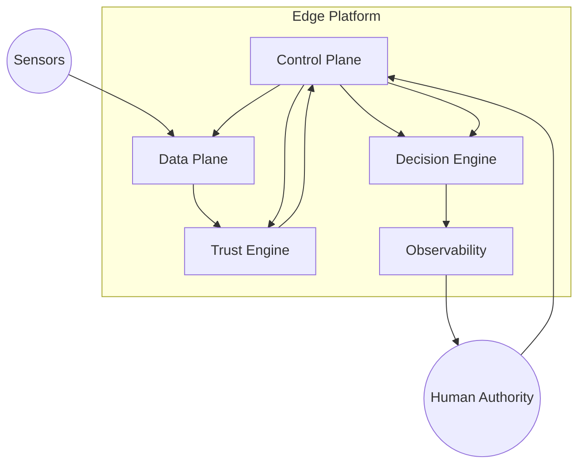

# C4 — Container View

These diagrams provide a high-level visual understanding of the system.

They are conceptual and technology-agnostic.

Container View
---

## Notes

>No peer-to-peer authority flows exist.

>Control Plane governs all interactions.

>Human authority remains external and final.

---

