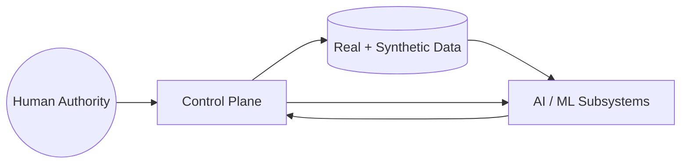

# SysML — Authority Relationship Model

These diagrams express formal operational states and transitions.

## Authority Relationship Model

---
### note right of AISubsystems : Advisory only. No authority transfer.
---