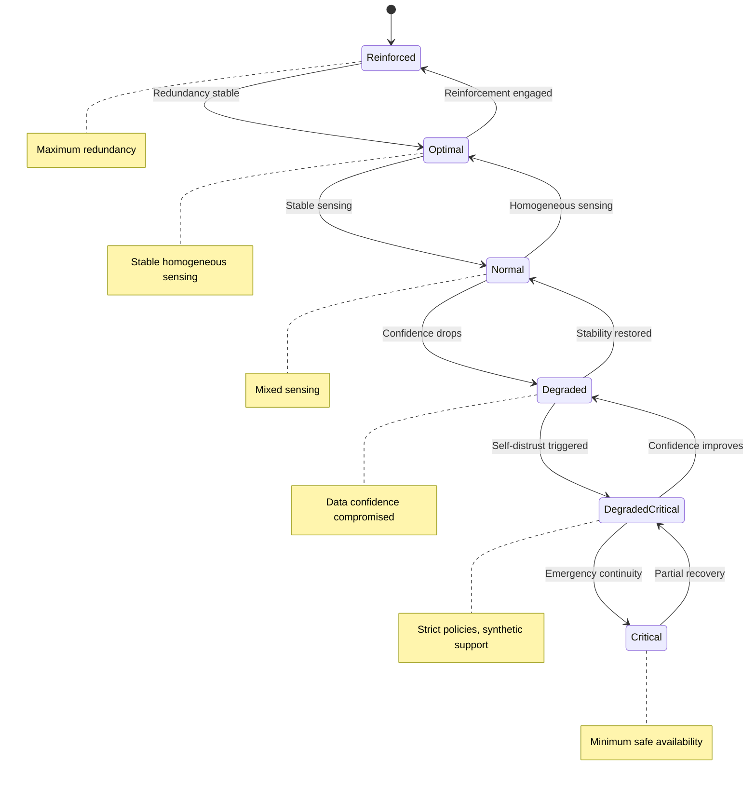

# SysML — System State Model

These diagrams express formal operational states and transitions.

## System State Model

---
### note right of AISubsystems : Advisory only. No authority transfer.
---