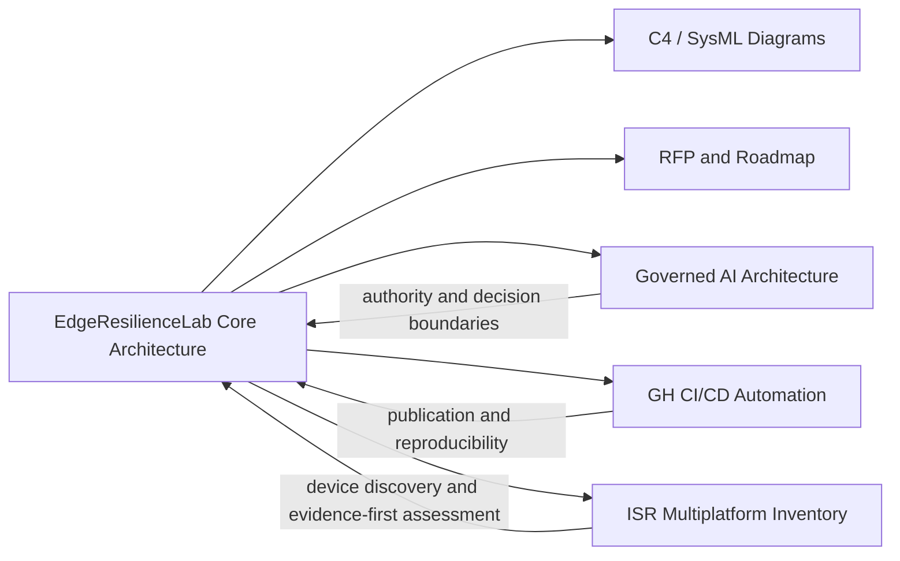

# Component Relationship Model

EdgeResilienceLab is organized as a public architecture package with complementary reference components.

## Relationship Summary

## Interpretation

- ERL provides the architecture and governance frame.
- Governed AI material reinforces authority, trust, and decision-boundary reasoning.
- GH_CI-CD contributes reproducible publication and deployment automation patterns.
- ISR multiplatform tooling contributes evidence-first device discovery and assessment discipline.

The relationship is complementary. The integrated components do not convert ERL into a finished implementation.
