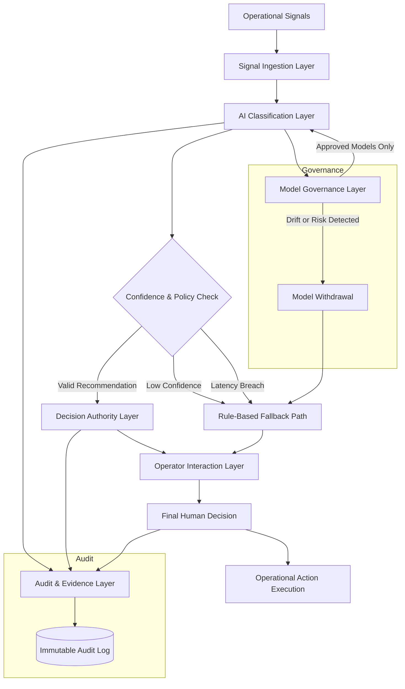

# Daniel Franco

### Principal Systems Architect — Governed Architecture & Resilient Operations

 

&nbsp;

---

# Governed AI & Risk Engineering — Authority Flow

---

```mermaid
flowchart TD

%% =========================================================
%% Governed AI & Risk Engineering — Authority Flow
%% =========================================================

A[Operational Signals] --> B[Signal Ingestion Layer]

B --> C[AI Classification Layer]

C --> D{Confidence & Policy Check}

D -->|Valid Recommendation| E[Decision Authority Layer]
D -->|Low Confidence| F[Rule-Based Fallback Path]
D -->|Latency Breach| F

E --> G[Operator Interaction Layer]

G --> H[Final Human Decision]

H --> I[Operational Action Execution]

%% =========================================================
%% Governance Control
%% =========================================================

C --> J[Model Governance Layer]
J -->|Approved Models Only| C
J -->|Drift or Risk Detected| K[Model Withdrawal]

%% =========================================================
%% Audit & Evidence
%% =========================================================

C --> L[Audit & Evidence Layer]
E --> L
H --> L

L --> M[(Immutable Audit Log)]

%% =========================================================
%% Fail-Safe Paths
%% =========================================================

K --> F
F --> G

%% =========================================================
%% Visual Grouping
%% =========================================================

subgraph Governance
J
K
end

subgraph Audit
L
M
end

```

